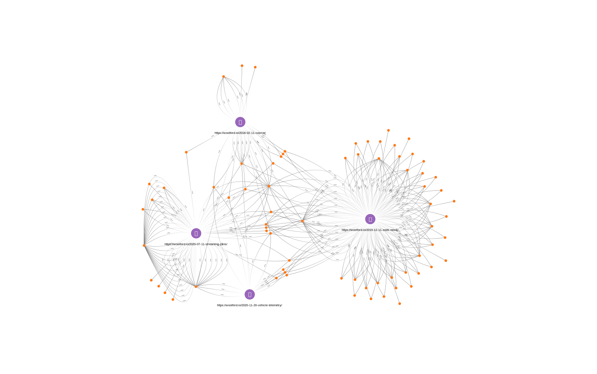

# snowplow-neo4j-recommender

The graph is built, dynamically, using the Neo4j connector:

Once the data is in Kafka, we can build a graph of the `domain_userid`'s and `page_url`'s

    http PUT snowplow.woolford.io:8083/connectors/snowplow-neo4j/config <<< '
    {
        "connector.class": "streams.kafka.connect.sink.Neo4jSinkConnector",
        "key.converter": "org.apache.kafka.connect.storage.StringConverter",
        "name": "snowplow-neo4j",
        "neo4j.server.uri": "neo4j+s://45940f18.databases.neo4j.io:7687",
        "neo4j.authentication.basic.username": "neo4j",
        "neo4j.authentication.basic.password": "********",
        "neo4j.topic.cypher.snowplow-enriched-good-json": "MERGE(u:User {domain_userid: event.domain_userid}) MERGE(p:Page {page_urlpath: event.page_urlpath}) MERGE(u)-[:VIEWED {timestamp: apoc.date.fromISO8601(event.derived_tstamp)}]->(p)",
        "topics": "snowplow-enriched-good-json",
        "value.converter": "org.apache.kafka.connect.json.JsonConverter",
        "value.converter.schemas.enable": "false"
    }'

Here's an explanation of the Neo4j Cypher statement:

The REST service returns a list of page recommendations for a `domain_userid` (which, is the guid starting with `8a51...` below):

    http localhost:8081/recommendations/ea1a9c2f-062e-4c15-9b42-36e9358f1462
    [
        {
            "id": 4,
            "pageTitle": "Zeek, Kafka, and Neo4j",
            "pageUrl": "https://woolford.io/2019-12-11-zeek-neo4j/"
        },
        {
            "id": 1,
            "pageTitle": "streaming joins in ksqlDB",
            "pageUrl": "https://woolford.io/2020-07-11-streaming-joins/"
        },
        {
            "id": 5,
            "pageTitle": "a $10 pot of honey",
            "pageUrl": "https://woolford.io/2018-02-11-cowrie/"
        }
    ]

It's also possible to retrieve a list of views for each `domain_userid`, e.g.

    http localhost:8081/history/ea1a9c2f-062e-4c15-9b42-36e9358f1462
    [
      {
        "derivedTstamp": 1628633015000,
        "pageUrl": "https://woolford.io/2020-11-20-vehicle-telemetry/"
      },
      {
        "derivedTstamp": 1628629415000,
        "pageUrl": "https://woolford.io/2020-07-11-streaming-joins/"
      },
      {
        "derivedTstamp": 1628618615000,
        "pageUrl": "https://woolford.io/2019-12-11-zeek-neo4j/"
      },
      {
        "derivedTstamp": 1628612255000,
        "pageUrl": "https://woolford.io/2018-02-11-cowrie/"
      }
    ]

## run the recommender inside a Docker container

This service was embedded in a Docker container and pushed to DockerHub so it's easy to setup.

    docker run -d -p 8080:8081/tcp --env-file snowplow-neo4j.env alexwoolford/snowplow-neo4j-recommender:1.0.0

snowplow-neo4j.env

    <pre>
    SPRING_NEO4J_URI=neo4j+s://45940f18.databases.neo4j.io:7687
    SPRING_NEO4J_AUTHENTICATION_USERNAME=neo4j
    SPRING_NEO4J_AUTHENTICATION_PASSWORD=********
    SPRING_DATA_NEO4J_DATABASE=neo4j
    </pre>

[//]: # (TODO: data science: add Louvain community - calc and remove)
[//]: # (TODO: plot points on map)
[//]: # (TODO: combine with JA3 from Zeek)
[//]: # (TODO: Sankey visualization for journey)
[//]: # (TODO: link prediction)
