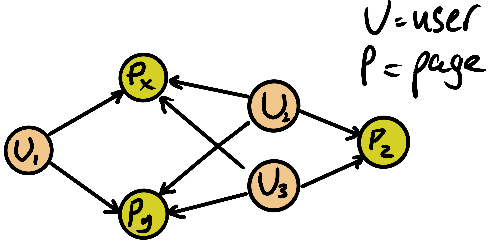

# snowplow-neo4j-recommender

The graph is built, dynamically, using the Neo4j connector:

Once the data is in Kafka, we can build a graph of the `network_userid`'s and `page_url`'s

    http PUT cp01.woolford.io:8083/connectors/snowplow-neo4j/config <<< '
    {
        "connector.class": "streams.kafka.connect.sink.Neo4jSinkConnector",
        "name": "snowplow-neo4j",
        "neo4j.authentication.basic.password": "V1ctoria",
        "neo4j.authentication.basic.username": "neo4j",
        "neo4j.server.uri": "bolt://neo4j-snowplow.woolford.io:7687",
        "neo4j.topic.cypher.snowplow-enriched-json-good": "MERGE (network_userid:network_userid {id: event.network_userid}) MERGE (page_url:page_url {id: event.page_url}) MERGE (network_userid)-[:VIEWED]->(page_url)",
        "topics": "snowplow-enriched-json-good",
        "key.converter": "org.apache.kafka.connect.storage.StringConverter",
        "value.converter": "org.apache.kafka.connect.json.JsonConverter",
        "value.converter.schemas.enable": "false"
    }'

Here's an explanation of the Neo4j Cypher statement:

The REST service returns a list of page recommendations for a `network_userid` (which, is the guid starting with `8a51...` below):

    http localhost:8080/recommendations/8a5107ba-bffa-47de-ba9a-6fc74f08ac62
    [
        {
            "pageUrl": "https://woolford.io/2018-02-11-cowrie/"
        },
        {
            "pageUrl": "https://woolford.io/2020-07-11-streaming-joins/"
        }
    ]

